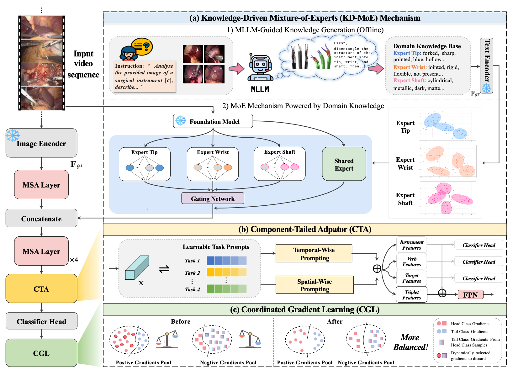

# Optimize Surgical Triplet Recognition: A Knowledge-Driven Mixture-of-Experts Solution



This repository contains a code release for surgical triplet recognition on CholecT45/CholecT50.
## Repository Contents

```text
MoeCo/
├── dataloader.py           # CholecT45/CholecT50 dataset loading
├── network.py              # Main model, CTA, KD-MoE, task-branch variants
├── network_trans.py        # Transformer/VPT/ST-Adapter components
├── blocks.py               # Temporal convolution/transformer blocks
├── taskprompter.py         # Prompt backbone components
├── loss/                   # Loss functions, including CGL-related code
├── clip/                   # Lightweight text/attribute descriptor embeddings
├── all_data*.json          # Class-frequency statistics for CGL splits
└── requirements.txt
```


## Dataset

The code supports the CholecT45/CholecT50 surgical triplet datasets. A typical CholecT45 directory should look like:

```text
/path/to/CholecT45/
├── data/
│   ├── VID01/
│   │   ├── 000000.png
│   │   ├── 000001.png
│   │   └── ...
│   └── ...
├── instrument/
│   ├── VID01.txt
│   └── ...
├── verb/
├── target/
├── triplet/
└── dict/
```

## Environment

The code was developed with Python 3.10 and PyTorch. A typical setup is:

```bash
conda create -n moecot python=3.10 -y
conda activate moecot
pip install -r requirements.txt
```

Install the PyTorch build matching your CUDA version from the official PyTorch website if needed. Our experiments were conducted on NVIDIA GPUs.

## Notes

- MLLM-generated instrument attributes are included in `dataloader.py`.
- Some files still contain absolute paths inherited from the experimental environment. These paths will be cleaned in the full artifact release.
